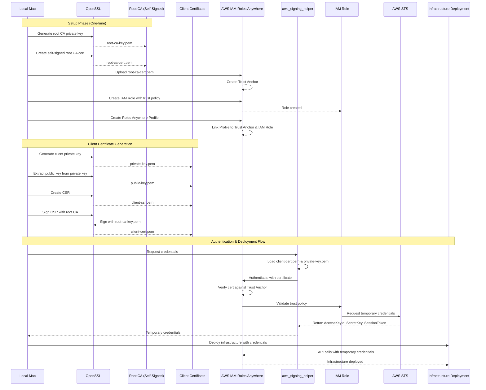

# CLAUDE.md

This file provides guidance to Claude Code (claude.ai/code) when working with code in this repository.

## Project Overview

This repository implements Public Key Infrastructure (PKI) for AWS IAM Roles Anywhere, enabling secure authentication from this Mac to AWS accounts using self-signed certificates. The project uses OpenSSL for certificate management and allows infrastructure deployment using temporary credentials obtained through IAM Roles Anywhere.

## Key Concepts

**IAM Roles Anywhere**: AWS service that allows workloads running outside of AWS to obtain temporary AWS credentials by authenticating with X.509 certificates instead of long-term access keys.

**Certificate Hierarchy**:
- Root CA (Certificate Authority): Self-signed root certificate that anchors the trust chain
- Intermediate CA (optional): Signed by root CA, used to issue client certificates
- Client Certificate: Used by this workstation to authenticate to AWS IAM Roles Anywhere

## Common Commands

### Certificate Generation

**IMPORTANT**: AWS IAM Roles Anywhere requires X.509 v3 certificates. Use the OpenSSL configuration file to generate v3 certificates with proper extensions.

```bash
# Generate root CA private key
openssl genrsa -out root-ca-key.pem 4096

# Create root CA certificate (self-signed, v3 with extensions)
openssl req -new -x509 -days 3650 -key root-ca-key.pem -out root-ca-cert.pem -config openssl.cnf -extensions v3_ca

# Generate client private key
openssl genrsa -out private-key.pem 2048

# Generate public key from private key
openssl rsa -in private-key.pem -pubout -out public-key.pem

# Create certificate signing request (CSR) for client
openssl req -new -key private-key.pem -out client-csr.pem -subj "/C=US/ST=Washington/L=Seattle/O=Personal/OU=Personal/CN=MacStudio"

# Sign client certificate with root CA (v3 with client extensions)
openssl x509 -req -days 365 -in client-csr.pem -CA root-ca-cert.pem -CAkey root-ca-key.pem -CAcreateserial -out client-cert.pem -extfile openssl.cnf -extensions v3_client

# Verify certificate chain
openssl verify -CAfile root-ca-cert.pem client-cert.pem

# Inspect certificate details and verify it's v3
openssl x509 -in client-cert.pem -text -noout | grep -E "Version|Subject|Issuer|CA:"

# Check root CA certificate version
openssl x509 -in root-ca-cert.pem -text -noout | grep -E "Version|CA:"

# Create PFX/PKCS12 file for macOS Keychain (includes client cert + private key + CA cert)
# Note: macOS security command requires a password, cannot use empty password
openssl pkcs12 -export -out client-cert.pfx -inkey private-key.pem -in client-cert.pem -certfile root-ca-cert.pem -name "MacStudio Client Certificate" -passout pass:tempPassword123
```

### macOS Keychain Integration

```bash
# Import PFX file into macOS Keychain (double-click or use command)
open client-cert.pfx

# Or import via command line to specific keychain
security import client-cert.pfx -k ~/Library/Keychains/login.keychain-db

# List certificates in keychain
security find-certificate -a -c "MacStudio"

# Export certificate from keychain (if needed)
security find-certificate -c "MacStudio" -p > exported-cert.pem
```

### AWS IAM Roles Anywhere Setup

```bash
# Create trust anchor in AWS (upload root CA certificate)
aws rolesanywhere create-trust-anchor --name "Personal-Mac-CA" --source sourceType=CERTIFICATE_BUNDLE,sourceData={x509CertificateData="$(cat root-ca-cert.pem)"}

# Create profile for IAM Roles Anywhere
aws rolesanywhere create-profile --name "Personal-Mac-Profile" --role-arns "arn:aws:iam::ACCOUNT_ID:role/ROLE_NAME"

# List trust anchors
aws rolesanywhere list-trust-anchors

# List profiles
aws rolesanywhere list-profiles
```

### Using Credentials

```bash
# Use aws_signing_helper to obtain temporary credentials
aws_signing_helper credential-process \
  --certificate client-cert.pem \
  --private-key private-key.pem \
  --trust-anchor-arn arn:aws:rolesanywhere:REGION:ACCOUNT_ID:trust-anchor/TA_ID \
  --profile-arn arn:aws:rolesanywhere:REGION:ACCOUNT_ID:profile/PROFILE_ID \
  --role-arn arn:aws:iam::ACCOUNT_ID:role/ROLE_NAME

# Configure AWS CLI to use signing helper (in ~/.aws/config)
# [profile rolesanywhere]
# credential_process = aws_signing_helper credential-process --certificate /path/to/client-cert.pem --private-key /path/to/private-key.pem --trust-anchor-arn arn:... --profile-arn arn:... --role-arn arn:...

# Test credentials
aws sts get-caller-identity --profile rolesanywhere
```

## Architecture

### Flow Diagram



### Certificate Storage
- Private keys should be stored securely with restricted permissions (chmod 600)
- Root CA private key should be kept offline or in secure storage when not actively signing certificates
- Client certificates and keys should be stored in a consistent location (e.g., `./certs/`)

### Trust Chain
1. Root CA is registered as a Trust Anchor in AWS IAM Roles Anywhere
2. Client certificates are signed by the Root CA
3. When authenticating, IAM Roles Anywhere validates the client certificate against the Trust Anchor
4. Upon successful validation, temporary AWS credentials are issued based on the configured IAM role

### Security Considerations
- Root CA private key is the most sensitive asset - compromise means entire trust chain is broken
- Client certificate validity period should be limited (typically 365 days or less)
- Implement certificate rotation before expiration
- Monitor certificate expiration dates
- Never commit private keys to version control (add `*.pem`, `*.key` to .gitignore)
- **AWS IAM Roles Anywhere requires X.509 v3 certificates** - v1 certificates will be rejected with error "Certificate is not v3"
- All certificates must include proper v3 extensions (basicConstraints, keyUsage, etc.)

## File Organization

Expected directory structure:
```
.
├── certs/
│   ├── openssl.cnf           # OpenSSL config for v3 certificate extensions
│   ├── root-ca-key.pem       # Root CA private key (keep secure!)
│   ├── root-ca-cert.pem      # Root CA certificate (v3, upload to AWS)
│   ├── root-ca-cert.srl      # Serial number file (auto-generated)
│   ├── private-key.pem       # Client private key
│   ├── public-key.pem        # Client public key
│   ├── client-csr.pem        # Certificate signing request
│   ├── client-cert.pem       # Client certificate (v3)
│   ├── client-cert.pfx       # PKCS12/PFX bundle (for macOS Keychain)
│   └── aws_signing_helper    # AWS signing helper binary
├── scripts/
│   ├── generate-root-ca.sh   # Automate root CA generation
│   ├── generate-client-cert.sh # Automate client cert generation
│   └── setup-aws-profile.sh  # Configure AWS CLI profile
└── infrastructure/
    └── terraform/            # Infrastructure as code for deployment
```

### OpenSSL Configuration (openssl.cnf)

The `openssl.cnf` file defines X.509 v3 extensions required by AWS IAM Roles Anywhere:

```ini
# OpenSSL configuration for v3 certificates

[ req ]
default_bits = 4096
distinguished_name = req_distinguished_name
x509_extensions = v3_ca
prompt = no

[ req_distinguished_name ]
C = US
ST = Washington
L = Seattle
O = Personal
OU = Personal
CN = MacStudio Root CA

[ v3_ca ]
subjectKeyIdentifier = hash
authorityKeyIdentifier = keyid:always,issuer
basicConstraints = critical, CA:true
keyUsage = critical, digitalSignature, cRLSign, keyCertSign

[ v3_client ]
subjectKeyIdentifier = hash
authorityKeyIdentifier = keyid,issuer
basicConstraints = CA:false
keyUsage = critical, digitalSignature, keyEncipherment
extendedKeyUsage = clientAuth
```

**Key Extensions**:
- `v3_ca`: For root CA certificate - marks it as a CA that can sign other certificates
- `v3_client`: For client certificate - marks it for client authentication with proper key usage

## Deployment Workflow

1. Generate PKI certificates locally using OpenSSL
2. Register Root CA certificate as Trust Anchor in AWS IAM Roles Anywhere
3. Create IAM Role with appropriate permissions and trust policy
4. Create IAM Roles Anywhere Profile linking the role to the trust anchor
5. Configure aws_signing_helper with client certificate and private key
6. Use temporary credentials to deploy infrastructure (Terraform, CDK, etc.)


## Setup in AWS 
1. Upload root-ca-cert.pem to AWS IAM Roles Anywhere as a Trust Anchor
2. Create an IAM Role with appropriate trust policy
3. Create an IAM Roles Anywhere Profile
4. Configure aws_signing_helper to use client-cert.pem and private-key.pem for authentication

## Required Tools

- OpenSSL (for certificate generation and management)
- AWS CLI (for IAM Roles Anywhere setup)
- aws_signing_helper (AWS tool for credential process with X.509 certificates)
  - Documentation: https://docs.aws.amazon.com/rolesanywhere/latest/userguide/credential-helper.html
  - **Download for macOS Apple Silicon (ARM64):**
    ```bash
    curl -o aws_signing_helper https://rolesanywhere.amazonaws.com/releases/1.7.1/Aarch64/MacOS/Sonoma/aws_signing_helper
    chmod +x aws_signing_helper
    ```
  - **Download for macOS Intel (x86_64):**
    ```bash
    curl -o aws_signing_helper https://rolesanywhere.amazonaws.com/releases/1.7.1/X86_64/MacOS/Ventura/aws_signing_helper
    chmod +x aws_signing_helper
    ```
- Terraform or AWS CDK (for infrastructure deployment)


## Mac Setup

```bash
# Set password for keychain
CREDENTIAL_HELPER_KEYCHAIN_PASSWORD="credential-helper-password"

# 1. Create a new Keychain
security create-keychain -p ${CREDENTIAL_HELPER_KEYCHAIN_PASSWORD} credential-helper.keychain

# 2. Unlock the Keychain
security unlock-keychain -p ${CREDENTIAL_HELPER_KEYCHAIN_PASSWORD} credential-helper.keychain

# 3. Verify keychain is in search list (should be added automatically)
security list-keychains

# 4. Import certificate and private key with aws_signing_helper trust
# Note: Use the path to aws_signing_helper binary (e.g., ./aws_signing_helper if in certs directory)
security import client-cert.pfx -T ./aws_signing_helper -P tempPassword123 -k credential-helper.keychain

# 5. Verify the import
security find-certificate -a -c "MacStudio" credential-helper.keychain
```


## Testing Credential Generation

Once the keychain setup is complete, test credential generation:

```bash
# Test aws_signing_helper credential generation
./aws_signing_helper credential-process \
    --certificate client-cert.pem \
    --private-key private-key.pem \
    --trust-anchor-arn "arn:aws:rolesanywhere:us-east-1:257641256327:trust-anchor/81775349-8317-484e-98d0-7cc4a9a37dba" \
    --profile-arn "arn:aws:rolesanywhere:us-east-1:257641256327:profile/d911c7cc-1fdb-401e-a39f-90f627e54b3e" \
    --role-arn "arn:aws:iam::257641256327:role/admin-role-anywhere"
```

**Expected Output:**
```json
{
  "Version": 1,
  "AccessKeyId": "ASIA...",
  "SecretAccessKey": "...",
  "SessionToken": "...",
  "Expiration": "2025-10-17T05:28:15Z"
}
```

## Common Issues

### Wrong Binary Architecture
**Error:** `exec format error: ./aws_signing_helper`
**Solution:** You have the wrong architecture binary. Check your Mac's architecture:
```bash
uname -m  # Returns 'arm64' for Apple Silicon or 'x86_64' for Intel
```
Download the correct version from the links in Required Tools section.

### MAC Verification Failed
**Error:** `MAC verification failed during PKCS12 import (wrong password?)`
**Solution:** The PFX file was created with a password. Ensure you're using the correct password (e.g., `tempPassword123`) in the import command.

## Automated Credential Export Script

A zsh script has been created at `/Users/ashes/aws-credentials-export.zsh` to automatically fetch and export AWS credentials.

### Usage

**To export credentials in your current shell:**
```bash
source ~/aws-credentials-export.zsh
```

**To use in other scripts:**
```bash
eval $(~/aws-credentials-export.zsh)
```

**To just display credentials:**
```bash
~/aws-credentials-export.zsh
```

### Script Features

- Automatically fetches temporary AWS credentials via IAM Roles Anywhere
- Exports `AWS_ACCESS_KEY_ID`, `AWS_SECRET_ACCESS_KEY`, and `AWS_SESSION_TOKEN`
- Displays credential expiration time
- Color-coded output for success/error messages
- Validates that aws_signing_helper and certificates exist
- Error handling with helpful messages

### Script Configuration

The script is pre-configured with:
- Certificate path: `/Users/ashes/Documents/AWSAuth/Personal/certs/client-cert.pem`
- Private key path: `/Users/ashes/Documents/AWSAuth/Personal/certs/private-key.pem`
- Trust Anchor ARN: `arn:aws:rolesanywhere:us-east-1:257641256327:trust-anchor/81775349-8317-484e-98d0-7cc4a9a37dba`
- Profile ARN: `arn:aws:rolesanywhere:us-east-1:257641256327:profile/d911c7cc-1fdb-401e-a39f-90f627e54b3e`
- Role ARN: `arn:aws:iam::257641256327:role/read-role-anywhere`

Edit the script to update these values if your AWS configuration changes.