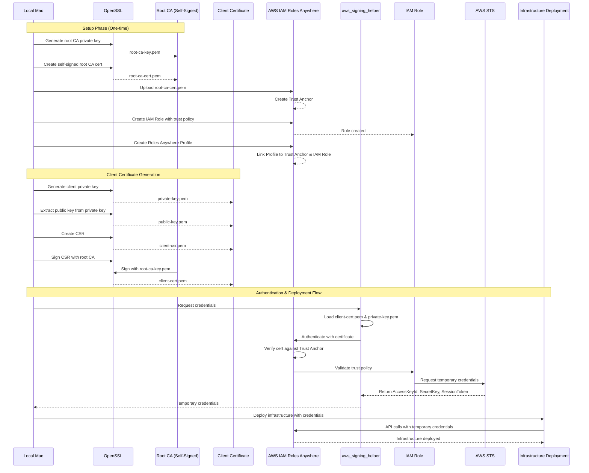

# CLAUDE.md

This file provides guidance to Claude Code (claude.ai/code) when working with code in this repository.

## Project Overview

**This is a template/reference repository** that demonstrates how to implement Public Key Infrastructure (PKI) for AWS IAM Roles Anywhere. It enables secure authentication from macOS to AWS accounts using self-signed certificates, eliminating the need for long-term IAM access keys.

The project uses OpenSSL for certificate management and allows infrastructure deployment using temporary credentials obtained through IAM Roles Anywhere. Use this as a reference when setting up PKI authentication for your own AWS accounts.

## Key Concepts

**IAM Roles Anywhere**: AWS service that allows workloads running outside of AWS to obtain temporary AWS credentials by authenticating with X.509 certificates instead of long-term access keys.

**Certificate Hierarchy**:
- Root CA (Certificate Authority): Self-signed root certificate that anchors the trust chain
- Intermediate CA (optional): Signed by root CA, used to issue client certificates
- Client Certificate: Used by this workstation to authenticate to AWS IAM Roles Anywhere

## Architecture

### Flow Diagram



### Certificate Storage
- Private keys should be stored securely with restricted permissions (chmod 600)
- Root CA private key should be kept offline or in secure storage when not actively signing certificates
- Client certificates and keys should be stored in a consistent location (e.g., `./certs/`)

### Trust Chain
1. Root CA is registered as a Trust Anchor in AWS IAM Roles Anywhere
2. Client certificates are signed by the Root CA
3. When authenticating, IAM Roles Anywhere validates the client certificate against the Trust Anchor
4. Upon successful validation, temporary AWS credentials are issued based on the configured IAM role

### Security Considerations
- Root CA private key is the most sensitive asset - compromise means entire trust chain is broken
- Client certificate validity period should be limited (typically 365 days or less)
- Implement certificate rotation before expiration
- Monitor certificate expiration dates
- Never commit private keys to version control (add `*.pem`, `*.key` to .gitignore)
- **AWS IAM Roles Anywhere requires X.509 v3 certificates** - v1 certificates will be rejected with error "Certificate is not v3"
- All certificates must include proper v3 extensions (basicConstraints, keyUsage, etc.)

## Common Commands

### Certificate Generation

**IMPORTANT**: AWS IAM Roles Anywhere requires X.509 v3 certificates. Use the OpenSSL configuration file to generate v3 certificates with proper extensions.

**Note**: All OpenSSL commands below should be run from the `certs/` directory where the `openssl.cnf` file is located.

```bash
# Create a certs directory
mkdir certs

# Navigate to certs directory
cd certs/

# Generate root CA private key
openssl genrsa -out root-ca-key.pem 4096

# Create root CA certificate (self-signed, v3 with extensions)
openssl req -new -x509 -days 3650 -key root-ca-key.pem -out root-ca-cert.pem -config openssl.cnf -extensions v3_ca

# Generate client private key
openssl genrsa -out private-key.pem 2048

# Generate public key from private key
openssl rsa -in private-key.pem -pubout -out public-key.pem

# Create certificate signing request (CSR) for client
# Replace the values below with your own information:
# C=Country, ST=State, L=City, O=Organization, OU=Organizational Unit, CN=Common Name
openssl req -new -key private-key.pem -out client-csr.pem -subj "/C=COUNTRY/ST=STATE/L=CITY/O=ORGANIZATION/OU=ORG_UNIT/CN=HOSTNAME"

# Example:
# openssl req -new -key private-key.pem -out client-csr.pem -subj "/C=US/ST=California/L=San Francisco/O=MyCompany/OU=Engineering/CN=MyMacBook"

# Sign client certificate with root CA (v3 with client extensions)
openssl x509 -req -days 365 -in client-csr.pem -CA root-ca-cert.pem -CAkey root-ca-key.pem -CAcreateserial -out client-cert.pem -extfile openssl.cnf -extensions v3_client

# Verify certificate chain
openssl verify -CAfile root-ca-cert.pem client-cert.pem

# Inspect certificate details and verify it's v3
openssl x509 -in client-cert.pem -text -noout | grep -E "Version|Subject|Issuer|CA:"

# Check root CA certificate version
openssl x509 -in root-ca-cert.pem -text -noout | grep -E "Version|CA:"

# Create PFX/PKCS12 file for macOS Keychain (includes client cert + private key + CA cert)
# Note: macOS security command requires a password, cannot use empty password
# Replace "YOUR_HOSTNAME" with your machine's hostname
openssl pkcs12 -export -out client-cert.pfx -inkey private-key.pem -in client-cert.pem -certfile root-ca-cert.pem -name "YOUR_HOSTNAME Client Certificate" -passout pass:tempPassword123

# Example:
# openssl pkcs12 -export -out client-cert.pfx -inkey private-key.pem -in client-cert.pem -certfile root-ca-cert.pem -name "MyMacBook Client Certificate" -passout pass:tempPassword123
```

### macOS Keychain Integration

```bash
# Import PFX file into macOS Keychain (double-click or use command)
open client-cert.pfx

# Or import via command line to specific keychain
security import client-cert.pfx -k ~/Library/Keychains/login.keychain-db

# List certificates in keychain (replace YOUR_HOSTNAME with your certificate name)
security find-certificate -a -c "YOUR_HOSTNAME"

# Export certificate from keychain (if needed)
security find-certificate -c "YOUR_HOSTNAME" -p > exported-cert.pem

# Example:
# security find-certificate -a -c "MyMacBook"
```

### AWS IAM Roles Anywhere Setup

#### Step 1: Create IAM Role with Trust Policy

First, create an IAM role that IAM Roles Anywhere can assume. You need a trust policy that allows the `rolesanywhere.amazonaws.com` service to assume the role.

```bash
# Create a trust policy file
cat > trust-policy.json <<'EOF'
{
  "Version": "2012-10-17",
  "Statement": [
    {
      "Effect": "Allow",
      "Principal": {
        "Service": "rolesanywhere.amazonaws.com"
      },
      "Action": [
        "sts:AssumeRole",
        "sts:TagSession",
        "sts:SetSourceIdentity"
      ]
    }
  ]
}
EOF

# Create the IAM role with the trust policy
# Replace ROLE_NAME with your desired role name (e.g., "MyRolesAnywhereRole")
aws iam create-role \
    --role-name ROLE_NAME \
    --assume-role-policy-document file://trust-policy.json \
    --description "Role for IAM Roles Anywhere certificate-based authentication"

# Attach permissions policies to the role (choose based on your needs)
# Example: Attach ReadOnlyAccess policy
aws iam attach-role-policy \
    --role-name ROLE_NAME \
    --policy-arn arn:aws:iam::aws:policy/ReadOnlyAccess

# Example: Attach AdministratorAccess policy (use with caution!)
# aws iam attach-role-policy \
#     --role-name ROLE_NAME \
#     --policy-arn arn:aws:iam::aws:policy/AdministratorAccess

# Or attach a custom policy
# aws iam attach-role-policy \
#     --role-name ROLE_NAME \
#     --policy-arn arn:aws:iam::ACCOUNT_ID:policy/YOUR_CUSTOM_POLICY

# Verify the role was created
aws iam get-role --role-name ROLE_NAME
```

#### Step 2: Create Trust Anchor

```bash
# Create trust anchor in AWS (upload root CA certificate)
# Save the output - you'll need the trustAnchorArn
aws rolesanywhere create-trust-anchor \
    --name "YOUR_NAME-CA" \
    --source sourceType=CERTIFICATE_BUNDLE,sourceData={x509CertificateData="$(cat root-ca-cert.pem)"}

# Example output:
# {
#     "trustAnchor": {
#         "trustAnchorArn": "arn:aws:rolesanywhere:us-east-1:123456789012:trust-anchor/a1b2c3d4-5678-90ab-cdef-EXAMPLE11111",
#         "trustAnchorId": "a1b2c3d4-5678-90ab-cdef-EXAMPLE11111",
#         ...
#     }
# }
```

#### Step 3: Create Profile

```bash
# Create profile for IAM Roles Anywhere
# Replace ACCOUNT_ID and ROLE_NAME with your AWS account ID and IAM role name from Step 1
# Save the output - you'll need the profileArn
aws rolesanywhere create-profile \
    --name "YOUR_NAME-Profile" \
    --role-arns "arn:aws:iam::ACCOUNT_ID:role/ROLE_NAME"

# Example output:
# {
#     "profile": {
#         "profileArn": "arn:aws:rolesanywhere:us-east-1:123456789012:profile/b2c3d4e5-6789-01bc-defg-EXAMPLE22222",
#         "profileId": "b2c3d4e5-6789-01bc-defg-EXAMPLE22222",
#         ...
#     }
# }
```

#### Step 4: Verify Configuration

```bash
# List trust anchors (to retrieve ARN if needed)
aws rolesanywhere list-trust-anchors

# List profiles (to retrieve ARN if needed)
aws rolesanywhere list-profiles

# List IAM roles (to verify role exists)
aws iam list-roles --query 'Roles[?RoleName==`ROLE_NAME`]'
```

### Using Credentials

```bash
# Use aws_signing_helper to obtain temporary credentials
# Replace ARN values with those from the AWS IAM Roles Anywhere Setup section
aws_signing_helper credential-process \
  --certificate client-cert.pem \
  --private-key private-key.pem \
  --trust-anchor-arn arn:aws:rolesanywhere:REGION:ACCOUNT_ID:trust-anchor/TRUST_ANCHOR_ID \
  --profile-arn arn:aws:rolesanywhere:REGION:ACCOUNT_ID:profile/PROFILE_ID \
  --role-arn arn:aws:iam::ACCOUNT_ID:role/ROLE_NAME

# Configure AWS CLI to use signing helper (in ~/.aws/config)
# Replace the ARNs and paths with your actual values
# [profile rolesanywhere]
# credential_process = aws_signing_helper credential-process --certificate /path/to/certs/client-cert.pem --private-key /path/to/certs/private-key.pem --trust-anchor-arn arn:aws:rolesanywhere:REGION:ACCOUNT_ID:trust-anchor/TRUST_ANCHOR_ID --profile-arn arn:aws:rolesanywhere:REGION:ACCOUNT_ID:profile/PROFILE_ID --role-arn arn:aws:iam::ACCOUNT_ID:role/ROLE_NAME

# Example ~/.aws/config entry:
# [profile my-rolesanywhere]
# credential_process = aws_signing_helper credential-process --certificate /Users/myuser/certs/client-cert.pem --private-key /Users/myuser/certs/private-key.pem --trust-anchor-arn arn:aws:rolesanywhere:us-east-1:123456789012:trust-anchor/a1b2c3d4-5678-90ab-cdef-EXAMPLE11111 --profile-arn arn:aws:rolesanywhere:us-east-1:123456789012:profile/b2c3d4e5-6789-01bc-defg-EXAMPLE22222 --role-arn arn:aws:iam::123456789012:role/MyAdminRole

# Test credentials (replace 'rolesanywhere' with your profile name)
aws sts get-caller-identity --profile rolesanywhere
```

## File Organization

Expected directory structure:
```
.
├── README.md                     # Project overview and quick start guide
├── CLAUDE.md                     # Detailed implementation guide (this file)
├── aws-credentials-export.zsh    # Template script for credential automation
├── certs/
│   ├── openssl.cnf               # OpenSSL config for v3 certificate extensions
│   ├── root-ca-key.pem           # Root CA private key (keep secure!)
│   ├── root-ca-cert.pem          # Root CA certificate (v3, upload to AWS)
│   ├── root-ca-cert.srl          # Serial number file (auto-generated)
│   ├── private-key.pem           # Client private key
│   ├── public-key.pem            # Client public key
│   ├── client-csr.pem            # Certificate signing request
│   ├── client-cert.pem           # Client certificate (v3)
│   ├── client-cert.pfx           # PKCS12/PFX bundle (for macOS Keychain)
│   └── aws_signing_helper        # AWS signing helper binary
├── scripts/ (optional)
│   ├── generate-root-ca.sh       # Automate root CA generation
│   ├── generate-client-cert.sh   # Automate client cert generation
│   └── setup-aws-profile.sh      # Configure AWS CLI profile
└── infrastructure/ (optional)
    └── terraform/                # Infrastructure as code for deployment
```

### OpenSSL Configuration (openssl.cnf)

The `openssl.cnf` file defines X.509 v3 extensions required by AWS IAM Roles Anywhere:

```ini
# OpenSSL configuration for v3 certificates

[ req ]
default_bits = 4096
distinguished_name = req_distinguished_name
x509_extensions = v3_ca
prompt = no

[ req_distinguished_name ]
C = COUNTRY
ST = STATE
L = CITY
O = ORGANIZATION
OU = ORG_UNIT
CN = HOSTNAME Root CA

[ v3_ca ]
subjectKeyIdentifier = hash
authorityKeyIdentifier = keyid:always,issuer
basicConstraints = critical, CA:true
keyUsage = critical, digitalSignature, cRLSign, keyCertSign

[ v3_client ]
subjectKeyIdentifier = hash
authorityKeyIdentifier = keyid,issuer
basicConstraints = CA:false
keyUsage = critical, digitalSignature, keyEncipherment
extendedKeyUsage = clientAuth
```

**Key Extensions**:
- `v3_ca`: For root CA certificate - marks it as a CA that can sign other certificates
- `v3_client`: For client certificate - marks it for client authentication with proper key usage

**Example Configuration**:
```ini
[ req_distinguished_name ]
C = US
ST = California
L = San Francisco
O = MyCompany
OU = Engineering
CN = MyMacBook Root CA
```

## Quick Reference Checklist

Before starting implementation, ensure you have:
- [ ] OpenSSL installed and accessible
- [ ] AWS CLI installed and configured with credentials
- [ ] Downloaded `aws_signing_helper` binary for your architecture
- [ ] AWS account with permissions to create IAM roles and IAM Roles Anywhere resources
- [ ] Decided on certificate subject details (Country, State, City, Organization, Hostname)
- [ ] Decided on IAM role name and permissions policies

## Complete Setup Workflow

### Local Setup (One-time)
1. Generate PKI certificates locally using OpenSSL (see Certificate Generation section)
2. Download and configure `aws_signing_helper` binary (see Required Tools section)
3. Optionally import certificates into macOS Keychain (see macOS Keychain Integration section)

### AWS Setup (One-time)
1. Create an IAM Role with trust policy that allows `rolesanywhere.amazonaws.com` to assume it (see AWS IAM Roles Anywhere Setup - Step 1)
2. Attach appropriate permissions policies to the IAM Role (e.g., ReadOnlyAccess, AdministratorAccess, or custom policies)
3. Create a Trust Anchor by uploading your `root-ca-cert.pem` to AWS IAM Roles Anywhere (Step 2)
4. Create an IAM Roles Anywhere Profile linking the Trust Anchor to the IAM Role (Step 3)
5. Note the ARNs for Trust Anchor, Profile, and Role - you'll need these for authentication (Step 4)

### Using the Credentials
1. Configure `aws_signing_helper` with your certificate paths and ARNs (see Using Credentials section)
2. Use temporary credentials to deploy infrastructure (Terraform, CDK, etc.) or interact with AWS services
3. Credentials are automatically rotated - they expire after a set period (typically 1 hour)

## Required Tools

- OpenSSL (for certificate generation and management)
- AWS CLI (for IAM Roles Anywhere setup)
- aws_signing_helper (AWS tool for credential process with X.509 certificates)
  - Documentation: https://docs.aws.amazon.com/rolesanywhere/latest/userguide/credential-helper.html
  - **Download for macOS Apple Silicon (ARM64):**
    ```bash
    curl -o aws_signing_helper https://rolesanywhere.amazonaws.com/releases/1.7.1/Aarch64/MacOS/Sonoma/aws_signing_helper
    chmod +x aws_signing_helper
    ```
  - **Download for macOS Intel (x86_64):**
    ```bash
    curl -o aws_signing_helper https://rolesanywhere.amazonaws.com/releases/1.7.1/X86_64/MacOS/Ventura/aws_signing_helper
    chmod +x aws_signing_helper
    ```
- Terraform or AWS CDK (for infrastructure deployment)


## Mac Setup

```bash
# Set password for keychain
CREDENTIAL_HELPER_KEYCHAIN_PASSWORD="credential-helper-password"

# 1. Create a new Keychain
security create-keychain -p ${CREDENTIAL_HELPER_KEYCHAIN_PASSWORD} credential-helper.keychain

# 2. Unlock the Keychain
security unlock-keychain -p ${CREDENTIAL_HELPER_KEYCHAIN_PASSWORD} credential-helper.keychain

# 3. Verify keychain is in search list (should be added automatically)
security list-keychains

# 4. Import certificate and private key with aws_signing_helper trust
# Note: Use the path to aws_signing_helper binary (e.g., ./aws_signing_helper if in certs directory)
security import client-cert.pfx -T ./aws_signing_helper -P tempPassword123 -k credential-helper.keychain

# 5. Verify the import (replace YOUR_HOSTNAME with your certificate name)
security find-certificate -a -c "YOUR_HOSTNAME" credential-helper.keychain

# Example:
# security find-certificate -a -c "MyMacBook" credential-helper.keychain
```


## Testing Credential Generation

Once the keychain setup is complete, test credential generation using the ARNs from the AWS setup:

```bash
# Test aws_signing_helper credential generation
# Replace the ARN values with those obtained from the AWS IAM Roles Anywhere Setup commands above:
# - TRUST_ANCHOR_ARN: From the create-trust-anchor output (trustAnchorArn)
# - PROFILE_ARN: From the create-profile output (profileArn)
# - ROLE_ARN: Your IAM role ARN (same one used in create-profile)

./aws_signing_helper credential-process \
    --certificate client-cert.pem \
    --private-key private-key.pem \
    --trust-anchor-arn "arn:aws:rolesanywhere:REGION:ACCOUNT_ID:trust-anchor/TRUST_ANCHOR_ID" \
    --profile-arn "arn:aws:rolesanywhere:REGION:ACCOUNT_ID:profile/PROFILE_ID" \
    --role-arn "arn:aws:iam::ACCOUNT_ID:role/ROLE_NAME"

# Example:
# ./aws_signing_helper credential-process \
#     --certificate client-cert.pem \
#     --private-key private-key.pem \
#     --trust-anchor-arn "arn:aws:rolesanywhere:us-east-1:123456789012:trust-anchor/a1b2c3d4-5678-90ab-cdef-EXAMPLE11111" \
#     --profile-arn "arn:aws:rolesanywhere:us-east-1:123456789012:profile/b2c3d4e5-6789-01bc-defg-EXAMPLE22222" \
#     --role-arn "arn:aws:iam::123456789012:role/MyAdminRole"
```

**Expected Output:**
```json
{
  "Version": 1,
  "AccessKeyId": "ASIA...",
  "SecretAccessKey": "...",
  "SessionToken": "...",
  "Expiration": "2025-10-17T05:28:15Z"
}
```

## Common Issues

### Wrong Binary Architecture
**Error:** `exec format error: ./aws_signing_helper`
**Solution:** You have the wrong architecture binary. Check your Mac's architecture:
```bash
uname -m  # Returns 'arm64' for Apple Silicon or 'x86_64' for Intel
```
Download the correct version from the links in Required Tools section.

### MAC Verification Failed
**Error:** `MAC verification failed during PKCS12 import (wrong password?)`
**Solution:** The PFX file was created with a password. Ensure you're using the correct password (e.g., `tempPassword123`) in the import command.

### Certificate is not v3
**Error:** `Certificate is not v3` when using aws_signing_helper
**Solution:** AWS IAM Roles Anywhere requires X.509 v3 certificates. Ensure you used the `-config openssl.cnf -extensions v3_ca` (for root CA) and `-extfile openssl.cnf -extensions v3_client` (for client cert) flags when generating certificates. Verify with:
```bash
openssl x509 -in client-cert.pem -text -noout | grep -A 1 "Version"
# Should show: Version: 3 (0x2)
```

### Access Denied or Invalid Certificate
**Error:** `Access denied` or `Invalid certificate` when running aws_signing_helper
**Solution:**
1. Verify the Trust Anchor has the correct root CA certificate uploaded
2. Verify the client certificate was signed by the root CA: `openssl verify -CAfile root-ca-cert.pem client-cert.pem`
3. Check that the IAM Role exists and has the correct trust policy
4. Ensure the Profile is linked to the correct Trust Anchor and Role ARN

### Cannot Find Certificate in Keychain
**Error:** Certificate not found when aws_signing_helper tries to access keychain
**Solution:**
1. Import the certificate: `security import client-cert.pfx -T ./aws_signing_helper -P tempPassword123 -k credential-helper.keychain`
2. Unlock the keychain: `security unlock-keychain -p PASSWORD credential-helper.keychain`
3. Verify import: `security find-certificate -a -c "YOUR_HOSTNAME" credential-helper.keychain`

## Automated Credential Export Script

A template zsh script (`aws-credentials-export.zsh`) is included in this repository as an example implementation. You can copy this script to a convenient location (e.g., `~/aws-credentials-export.zsh`) and configure it with your certificate paths and AWS ARNs.

### Example Usage

**To export credentials in your current shell:**
```bash
source ~/aws-credentials-export.zsh
```

**To use in other scripts:**
```bash
eval $(~/aws-credentials-export.zsh)
```

**To just display credentials:**
```bash
~/aws-credentials-export.zsh
```

### Script Features (Example Implementation)

A credential export script should:
- Automatically fetch temporary AWS credentials via IAM Roles Anywhere using `aws_signing_helper`
- Export `AWS_ACCESS_KEY_ID`, `AWS_SECRET_ACCESS_KEY`, and `AWS_SESSION_TOKEN` as environment variables
- Display credential expiration time
- Validate that `aws_signing_helper` binary and certificates exist before attempting to fetch credentials
- Include error handling with helpful messages

### Script Configuration

When creating your own automation script, configure it with:
- Certificate path (e.g., `/path/to/certs/client-cert.pem`)
- Private key path (e.g., `/path/to/certs/private-key.pem`)
- Trust Anchor ARN: `arn:aws:rolesanywhere:REGION:ACCOUNT_ID:trust-anchor/TA_ID`
- Profile ARN: `arn:aws:rolesanywhere:REGION:ACCOUNT_ID:profile/PROFILE_ID`
- Role ARN: `arn:aws:iam::ACCOUNT_ID:role/ROLE_NAME`

Replace these placeholder values with your actual AWS resource ARNs from the AWS setup.